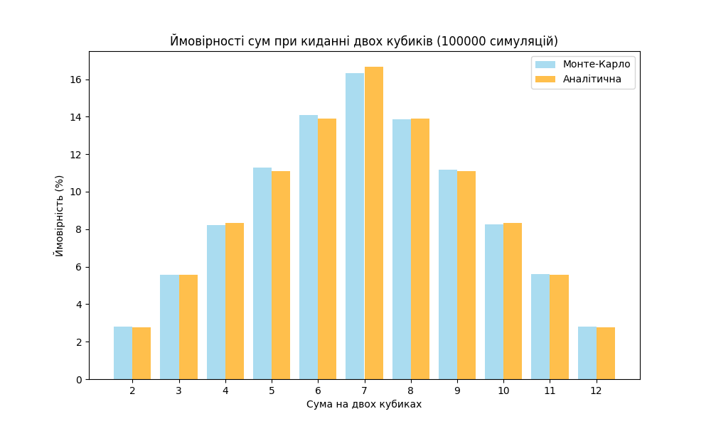

# goit-algo-fp
# Завдання 7: Метод Монте-Карло для кидання двох кубиків

## Мета
Імітувати кидання двох кубиків великою кількістю разів, обчислити суми чисел на кубиках та визначити ймовірність кожної можливої суми методом Монте-Карло. Порівняти отримані результати з аналітичними розрахунками.

---

## Методика
1. Було змодельовано **100000 кидань двох кубиків**.  
2. Для кожного кидка обчислювалася **сума двох кубиків**.  
3. Підраховувалася кількість випадків для кожної суми від 2 до 12.  
4. Ймовірність для кожної суми визначалася як частка від загальної кількості кидань.  
5. Результати порівнювалися з аналітичними ймовірностями, які відомі з теорії ймовірностей.

---

## Таблиця порівняння ймовірностей

| Сума | Монте-Карло (%) | Аналітична (%) |
|------|----------------|----------------|
| 2    | 2.80           | 2.78           |
| 3    | 5.58           | 5.56           |
| 4    | 8.24           | 8.33           |
| 5    | 11.29          | 11.11          |
| 6    | 14.10          | 13.89          |
| 7    | 16.32          | 16.67          |
| 8    | 13.88          | 13.89          |
| 9    | 11.16          | 11.11          |
| 10   | 8.24           | 8.33           |
| 11   | 5.59           | 5.56           |
| 12   | 2.80           | 2.78           |

*Примітка: Значення Монте-Карло можуть трохи відрізнятися через випадковість симуляції.*

---

## Графік ймовірностей

Нижче наведено порівняння результатів Монте-Карло та аналітичних значень:

- Сині стовпці — результати симуляції методом Монте-Карло  
- Помаранчеві стовпці — аналітичні ймовірності  

---

## Висновки
1. Метод Монте-Карло дозволяє наближено оцінити ймовірності випадіння сум кубиків без використання аналітичних формул.  
2. Чим більша кількість симуляцій, тим ближчі результати до аналітичних.  
3. Розподіл ймовірностей підтверджує класичні результати: сума 7 найімовірніша, 2 і 12 — найменш ймовірні.  
4. Графік наочно демонструє відповідність симуляції та теоретичного розподілу.

---

## Інструкція
1. Запустіть Python-скрипт для симуляції кидань кубиків.  
2. Збережіть графік як `dice_probs.png` у тій же папці, що й readme.md.  
3. Відкрийте readme.md, щоб побачити таблицю та графік.